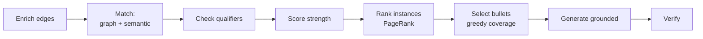
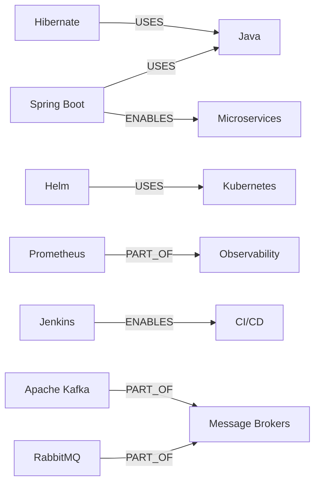

# Graph-Based ATS Resume Tailoring: Pipeline & Worked Example

Sep 22, 2026 · @Someone

## Overview

The two evidence fields turn this from keyword matching into evidence matching: the JD's sentence carries qualifiers, and the user's sentence is the only raw material for bullets.

The hard part is vocabulary. A user who has built Spring Boot services has Java experience but may never have typed "Java" into their notes. A literal ATS matcher misses it; the ontology closes the gap.

### Data model

```
(:User)-[:HAS]->(:WorkExperience|:Project|:Education)
(inst)-[:DEMONSTRATES {evidence, embedding, hasMetric, ownership}]->(:Skill)
(:JobDescription)-[:REQUIRES_SKILL {evidence, embedding, importance, weight,
                                    minYears, substitutable}]->(:Skill)
(:Skill)-[:USES|REQUIRES|ENABLES|PART_OF]->(:Skill)
```


### Three signals


| Signal             | Source                                            | Answers                                           |
| ------------------ | ------------------------------------------------- | ------------------------------------------------- |
| Ontology path      | `USES` / `PART_OF` / `ENABLES` / `REQUIRES` edges | Is the skill formally related to the requirement? |
| Evidence semantics | Cosine similarity of the two evidence embeddings  | Is this the same kind of work?                    |
| Evidence strength  | Metrics, ownership verb, recency on the user edge | Is this a compelling proof point?                 |


The first two decide whether a requirement is matched. The third decides which evidence wins the bullet when several qualify.

### Pipeline




Steps A–F are deterministic graph work. Only G calls a language model, and it may not invent facts.

## Step 0 — The example

Maya Chen applies for a Senior Backend Engineer (Payments) role. She never wrote the words "Java", "Microservices" or "Kubernetes" anywhere in her notes, yet she matches all three.

### Job description skills


| JD skill      | Importance | Weight | Evidence from the JD                                                |
| ------------- | ---------- | ------ | ------------------------------------------------------------------- |
| Java          | must       | 1.0    | 5+ years of professional experience with Java                       |
| Microservices | must       | 0.9    | design and build microservices handling high-volume payment traffic |
| Kubernetes    | must       | 0.8    | deploy and operate services on Kubernetes                           |
| PostgreSQL    | must       | 0.7    | strong SQL skills, PostgreSQL preferred                             |
| Apache Kafka  | nice       | 0.6    | event-driven systems using Kafka or similar                         |
| Observability | nice       | 0.5    | familiarity with Prometheus, Grafana                                |
| CI/CD         | nice       | 0.5    | own CI/CD pipelines for your services                               |
| Terraform     | nice       | 0.4    | infrastructure as code with Terraform                               |


### User instances and skills


| Instance                     | Period            | Skill       | Evidence the user wrote                                                              |
| ---------------------------- | ----------------- | ----------- | ------------------------------------------------------------------------------------ |
| PayLink — Backend Engineer   | Jan 2022–now      | Spring Boot | Built 12 Spring Boot services for card authorization, processing 3M transactions/day |
| PayLink                      | Jan 2022–now      | RabbitMQ    | Moved order events from DB polling to RabbitMQ, cutting end-to-end latency 40%       |
| PayLink                      | Jan 2022–now      | Helm        | Wrote Helm charts to deploy our services to EKS                                      |
| PayLink                      | Jan 2022–now      | PostgreSQL  | Tuned slow PostgreSQL queries, p95 from 800ms to 120ms                               |
| RetailCo — Software Engineer | Mar 2019–Dec 2021 | Hibernate   | Maintained Hibernate-based inventory system across 40 stores                         |
| RetailCo                     | Mar 2019–Dec 2021 | Jenkins     | Set up Jenkins pipelines, cutting release time from 2 days to 3 hours                |
| ledger-lite — side project   | 2024              | Prometheus  | Instrumented with Micrometer and Prometheus, built Grafana dashboards                |


### The ontology slice that bridges them




RabbitMQ and Kafka are siblings, not ancestors. That distinction drives a different decision later.

## Step 1 — Enrich edges at ingestion

Run one LLM extraction pass over each evidence sentence and store the result on the edge. This happens once per JD and once per user instance, never at query time.

### JD side: evidence to qualifiers

```cypher
MATCH (jd:JobDescription {id:$jdId})-[r:REQUIRES_SKILL]->(s:Skill {name:'Java'})
SET r.evidence      = '5+ years of professional experience with Java',
    r.minYears      = 5,
    r.substitutable = false,
    r.embedding     = $vec
```

For the Kafka requirement the extractor reads "or similar" and sets `substitutable: true`, which later unlocks sibling matching. For Java it sets `minYears: 5`, which becomes a hard check.


| Extracted field | Read from                               | Used in                    |
| --------------- | --------------------------------------- | -------------------------- |
| `minYears`      | 5+ years                                | Step 3 qualifier check     |
| `substitutable` | or similar, preferred, familiarity with | Step 2 sibling query       |
| `weight`        | must-have vs nice-to-have section       | Steps 2, 6 scoring         |
| `embedding`     | the whole sentence                      | Step 2 semantic similarity |


### User side: evidence to strength features

```cypher
MATCH (inst:WorkExperience {id:$instId})-[d:DEMONSTRATES]->(:Skill {name:'Spring Boot'})
SET d.evidence  = 'Built 12 Spring Boot services for card authorization, processing 3M transactions/day',
    d.hasMetric = true,
    d.ownership = 'built',
    d.embedding = $vec
```

`ownership` matters more than it looks. "Built" and "led" support strong resume verbs; "maintained" and "assisted" do not, and Step 8 refuses to upgrade them.

Index the embeddings so Step 2 stays fast:

```cypher
CREATE VECTOR INDEX evidence_jd IF NOT EXISTS
FOR ()-[r:REQUIRES_SKILL]-() ON (r.embedding)
OPTIONS {indexConfig: {`vector.dimensions`: 1536, `vector.similarity_function`: 'cosine'}}
```


## Step 2 — Candidate matching

One query covers direct hits and inferred hits, then blends the graph path with evidence similarity. The `*0..3` range makes a direct match a zero-hop path, so there is no separate query for it.

```cypher
MATCH (:JobDescription {id:$jdId})-[req:REQUIRES_SKILL]->(t:Skill)
MATCH (:User {id:$userId})-[:HAS]->(inst)-[d:DEMONSTRATES]->(us:Skill)
MATCH p = (us)-[:USES|PART_OF|ENABLES|REQUIRES*0..3]->(t)
WITH req, t, inst, d, max(reduce(w = 1.0, r IN relationships(p) |
  w * CASE type(r) WHEN 'USES'    THEN 0.85
                   WHEN 'PART_OF' THEN 0.75
                   WHEN 'ENABLES' THEN 0.65
                   ELSE 0.5 END)) AS graphConf
WITH req, t, inst, d, graphConf,
     vector.similarity.cosine(req.embedding, d.embedding) AS sim
RETURN t.name AS jdSkill, inst.title, d.evidence, graphConf, sim,
       graphConf * (0.5 + 0.5 * sim) AS score
ORDER BY jdSkill, score DESC
```

The `0.5 + 0.5 * sim` term means semantics can lift a match by half but never create one from nothing. A skill with no ontology path scores zero regardless of how similar the sentences read.

### Sibling match for substitutable requirements

RabbitMQ has no path *to* Kafka. They are siblings under Message Brokers, so a separate query is needed, and it only fires when the JD allows a substitute.

```cypher
MATCH (:JobDescription {id:$jdId})-[req:REQUIRES_SKILL {substitutable:true}]->(t:Skill)
MATCH (:User {id:$userId})-[:HAS]->(inst)-[d:DEMONSTRATES]->(us:Skill)
MATCH (us)-[:PART_OF|ENABLES]->(shared)<-[:PART_OF|ENABLES]-(t)
WHERE us <> t
RETURN t.name, us.name AS viaSkill, shared.name AS sharedParent,
       d.evidence, 0.4 AS graphConf
```


### Results for Maya

Best evidence per JD skill, after both queries:


| JD skill      | Matched via | Path    | graphConf | sim  | score |
| ------------- | ----------- | ------- | --------- | ---- | ----- |
| PostgreSQL    | PostgreSQL  | direct  | 1.00      | 0.74 | 0.87  |
| Kubernetes    | Helm        | USES    | 0.85      | 0.78 | 0.76  |
| Java          | Spring Boot | USES    | 0.85      | 0.71 | 0.73  |
| Observability | Prometheus  | PARTOF  | 0.75      | 0.88 | 0.71  |
| Microservices | Spring Boot | ENABLES | 0.65      | 0.86 | 0.60  |
| CI/CD         | Jenkins     | ENABLES | 0.65      | 0.69 | 0.55  |
| Apache Kafka  | RabbitMQ    | sibling | 0.40      | 0.81 | 0.36  |
| Terraform     | —           | none    | 0         | 0    | 0     |


Microservices shows why the second signal earns its place. The ontology path is only moderate (`ENABLES`, 0.65), but both evidence sentences describe high-volume payment services, so similarity of 0.86 pulls the match up to a usable score.

### Score bands


| Band      | Meaning   | Action                                                       |
| --------- | --------- | ------------------------------------------------------------ |
| ≥ 0.70    | Confident | Use the JD's exact term on the resume                        |
| 0.45–0.69 | Supported | Use the term, but only on a bullet whose evidence carries it |
| 0.25–0.44 | Adjacent  | Never claim the term; name the user's own skill instead      |
| < 0.25    | Gap       | Report to the user, write nothing                            |


## Step 3 — Qualifier check

The JD asks for 5+ years of Java. Maya has no instance labelled Java, so roll the requirement down the ontology and collect the date ranges of everything that implies it.

```cypher
MATCH (:User {id:$userId})-[:HAS]->(inst)-[:DEMONSTRATES]->(s:Skill)
MATCH (s)-[:USES|PART_OF*0..2]->(:Skill {name:'Java'})
RETURN DISTINCT inst.title, inst.startDate,
       coalesce(inst.endDate, date()) AS endDate
ORDER BY inst.startDate
```


| Instance | Via skill          | Start    | End      |
| -------- | ------------------ | -------- | -------- |
| RetailCo | Hibernate → Java   | Mar 2019 | Dec 2021 |
| PayLink  | Spring Boot → Java | Jan 2022 | present  |


Union the intervals in application code rather than summing them. Two concurrent roles are not double the experience, and a naive `sum(durationMonths)` inflates the figure — the kind of error that collapses in an interview.

```python
def union_months(ranges):
    merged = []
    for start, end in sorted(ranges):
        if merged and start <= merged[-1][1]:
            merged[-1][1] = max(merged[-1][1], end)
        else:
            merged.append([start, end])
    return sum(months_between(s, e) for s, e in merged)
```

Result: about 7.5 years, so the requirement passes. Because ATS filters often screen on a years threshold, this belongs in the summary line as an explicit number.

When a qualifier fails, do not silently drop the skill. Downgrade it — keep the skill on the resume, omit the years claim, and surface the shortfall in the gap report.

## Step 4 — Evidence strength

Step 2 says a requirement is matched. Step 4 says which piece of evidence should prove it, scoring each user edge on its own merits.

```latex
\text{strength} = \left(0.4\,h + 0.3\,o + 0.3\right) \cdot e^{-\text{age}/36}
```

Here `h` is 1 when the evidence carries a metric, `o` is the ownership weight, and age is in months. Ownership runs from 1.0 for built, led or designed, to 0.6 for implemented or set up, down to 0.3 for maintained, supported or assisted.


| Evidence                              | Metric | Ownership    | Recency | Strength |
| ------------------------------------- | ------ | ------------ | ------- | -------- |
| 12 Spring Boot services, 3M txn/day   | yes    | built        | current | 0.95     |
| PostgreSQL p95 800ms → 120ms          | yes    | tuned        | current | 0.90     |
| RabbitMQ, latency −40%                | yes    | moved        | current | 0.88     |
| Jenkins, 2 days → 3 hours             | yes    | set up       | 2021    | 0.74     |
| Helm charts to EKS                    | no     | wrote        | current | 0.70     |
| Prometheus and Grafana dashboards     | no     | instrumented | 2024    | 0.68     |
| Hibernate inventory system, 40 stores | no     | maintained   | 2021    | 0.45     |


The Hibernate line scores lowest on every axis: no metric, a passive verb, five years old. It still proves Java, but Spring Boot proves it better, so it drops to a supporting bullet.

Each candidate bullet's priority is the product of three numbers already computed:

```latex
\text{priority} = w_{\text{JD}} \times \text{score}_{\text{match}} \times \text{strength}_{\text{evidence}}
```


## Step 5 — Rank instances with Personalized PageRank

Steps 2–4 score individual skills. This step scores whole roles and projects, which decides section order and how many bullets each one earns.

Seed the walk with the JD's skills and let it flow through the ontology into instances. A role touching many relevant skills accumulates rank even when no single skill is a standout.

```cypher
CALL gds.graph.project('resumeGraph',
  ['Skill','WorkExperience','Project','User'],
  {USES:{orientation:'UNDIRECTED'}, PART_OF:{orientation:'UNDIRECTED'},
   ENABLES:{orientation:'UNDIRECTED'}, REQUIRES:{orientation:'UNDIRECTED'},
   DEMONSTRATES:{orientation:'UNDIRECTED'}, HAS:{orientation:'UNDIRECTED'}})
```

The undirected orientation matters. Ontology edges point from specific to general, so a directed walk would leave the JD's skills and never reach back down into the user's instances.

```cypher
MATCH (:JobDescription {id:$jdId})-[r:REQUIRES_SKILL]->(s:Skill)
WITH collect({node: s, weight: r.weight}) AS seeds
CALL gds.pageRank.stream('resumeGraph',
  {sourceNodes: seeds, dampingFactor: 0.85, maxIterations: 30})
YIELD nodeId, score
WITH gds.util.asNode(nodeId) AS n, score
WHERE n:WorkExperience OR n:Project
RETURN n.title, score ORDER BY score DESC
```


| Instance    | PageRank | Relevant skills reached                                     | Bullets allotted |
| ----------- | -------- | ----------------------------------------------------------- | ---------------- |
| PayLink     | 0.41     | Java, Microservices, Kubernetes, PostgreSQL, Kafka-adjacent | 4                |
| RetailCo    | 0.18     | Java, CI/CD                                                 | 2                |
| ledger-lite | 0.12     | Observability                                               | 1                |


ledger-lite is a side project with a low absolute score, but it is the only evidence for Observability, so it keeps its slot. That is a coverage decision, not a ranking one, and Step 6 makes it explicit.

### Alternatives worth layering in


| Algorithm                        | What it adds                                                    | Where it lands                                  |
| -------------------------------- | --------------------------------------------------------------- | ----------------------------------------------- |
| Louvain on the JD skill subgraph | Clusters requirements into themes (cloud infra, data pipelines) | Skills-section grouping and the summary line    |
| Node Similarity (Jaccard)        | Cheap overlap score per instance against the JD skill set       | Sanity check on PageRank ordering               |
| FastRP or node2vec               | Fuzzy similarity for skill pairs with no explicit edge          | Catches ontology gaps before they become misses |
| Betweenness on the skill graph   | Finds bridge skills linking several JD themes                   | Which skill to name first in the summary        |


## Steps 6 and 7 — Bullet selection and gap report


### Greedy max-coverage selection

A resume has a fixed line budget, so picking the highest-priority bullets one by one is wrong: the top three might all prove Java. Instead, pick the bullet with the highest marginal value over requirements not yet covered.

```python
def select(bullets, jd_skills, budget):
    chosen, covered = [], set()
    while bullets and len(chosen) < budget:
        best = max(bullets, key=lambda b: sum(
            jd_skills[s].weight * b.match[s] * b.strength
            for s in b.covers if s not in covered))
        if marginal_value(best, covered) < MIN_GAIN:
            break
        chosen.append(best)
        covered |= set(best.covers)
        bullets.remove(best)
    return chosen
```


| Pick | Bullet                           | Newly covered       | Marginal value |
| ---- | -------------------------------- | ------------------- | -------------- |
| 1    | Spring Boot services, 3M txn/day | Java, Microservices | 1.21           |
| 2    | PostgreSQL p95 tuning            | PostgreSQL          | 0.55           |
| 3    | Helm charts to EKS               | Kubernetes          | 0.43           |
| 4    | RabbitMQ latency −40%            | (Kafka, partial)    | 0.19           |
| 5    | Jenkins release time             | CI/CD               | 0.20           |
| 6    | Prometheus and Grafana           | Observability       | 0.24           |
| —    | Hibernate inventory system       | none new            | 0.02           |


The Hibernate bullet covers only Java, already covered by pick 1, so its marginal value collapses. It survives on the resume purely to give RetailCo a second line, not because it wins coverage.

### Gap report — for the user, not the resume


| JD skill     | Status          | What to do                                                                                                                                              |
| ------------ | --------------- | ------------------------------------------------------------------------------------------------------------------------------------------------------- |
| Apache Kafka | Adjacent (0.36) | The JD accepts "or similar". Name RabbitMQ and event-driven architecture, never Kafka. If you have touched Kafka anywhere, add that evidence and rerun. |
| Terraform    | Gap (0)         | No path from any skill. Leave it off, or add evidence if you have unrecorded experience.                                                                |


This report is the honest counterweight to everything above. The graph makes it easy to manufacture adjacency, and a resume that claims Kafka off the back of RabbitMQ passes the ATS and then fails the phone screen.

## Steps 8 and 9 — Generation and output


### The grounded prompt

The model receives only the selected evidence, each item tagged with the JD terms it is licensed to use. It rewrites vocabulary; it does not add facts.

```
Rewrite each EVIDENCE as one resume bullet.

Rules:
- Use the JD TERMS verbatim where the evidence supports them.
- Keep every number from the evidence exactly. Add no new numbers,
  tools, technologies or scope.
- Your verb may not claim more ownership than OWNERSHIP states.
- Start with a past-tense verb. Maximum 25 words.

Item 1:
  EVIDENCE:  "Built 12 Spring Boot services for card authorization,
              processing 3M transactions/day"
  JD TERMS:  ["Java", "microservices", "payment"]
  OWNERSHIP: built

Item 2:
  EVIDENCE:  "Maintained Hibernate-based inventory system across 40 stores"
  JD TERMS:  ["Java"]
  OWNERSHIP: maintained
```

The `OWNERSHIP` line is what stops item 2 from becoming "Architected an inventory platform". Maintained means maintained.

### Final output — ATS plain text

```
MAYA CHEN
Senior Backend Engineer | maya.chen@email.com | linkedin.com/in/mayachen

SUMMARY
Backend engineer with 7+ years of Java experience building high-volume
payment microservices with Spring Boot, PostgreSQL and Kubernetes.

SKILLS
Languages & Frameworks: Java, Spring Boot, Hibernate
Architecture: Microservices, Event-Driven Architecture, RabbitMQ
Data: PostgreSQL, SQL
Infrastructure: Kubernetes, Amazon EKS, Helm
DevOps & Observability: CI/CD, Jenkins, Prometheus, Grafana

EXPERIENCE

Backend Engineer, PayLink | Jan 2022 - Present
- Designed and built 12 Java/Spring Boot microservices for card
  authorization, processing 3M payment transactions per day
- Optimized PostgreSQL queries, reducing p95 latency from 800ms to 120ms
- Introduced event-driven architecture by moving order events from
  database polling to RabbitMQ, cutting end-to-end latency 40%
- Deployed services to Kubernetes (Amazon EKS) using Helm charts

Software Engineer, RetailCo | Mar 2019 - Dec 2021
- Built CI/CD pipelines in Jenkins, reducing release time from 2 days
  to 3 hours
- Maintained Java/Hibernate inventory system serving 40 stores

PROJECTS

ledger-lite | Personal project
- Implemented observability with Micrometer and Prometheus, with
  Grafana dashboards for service metrics
```


### Formatting rules that keep parsers happy

- Single column, no tables, no text boxes, no headers or footers.
- Standard section names: Summary, Skills, Experience, Projects, Education.
- Dates as `Mon YYYY - Mon YYYY` on the same line as the role.
- Export to .docx or text-layer PDF; never a scanned or image-based PDF.
- Spell out each acronym once alongside its short form where the JD uses both.


## Step 10 — Verification

Two checks run on the generated text before it ships. Both are automatic, and either one can send a bullet back for a rewrite.

### Coverage check

Count literal JD terms now present in the resume, weighted by JD importance.


| JD skill      | Weight | Term present | Proven by                              |
| ------------- | ------ | ------------ | -------------------------------------- |
| Java          | 1.0    | yes          | Spring Boot bullet, Hibernate bullet   |
| Microservices | 0.9    | yes          | Spring Boot bullet                     |
| Kubernetes    | 0.8    | yes          | Helm/EKS bullet                        |
| PostgreSQL    | 0.7    | yes          | query tuning bullet                    |
| Apache Kafka  | 0.6    | no           | adjacent only — RabbitMQ named instead |
| Observability | 0.5    | yes          | Prometheus bullet                      |
| CI/CD         | 0.5    | yes          | Jenkins bullet                         |
| Terraform     | 0.4    | no           | genuine gap                            |


Six of eight skills covered, which is 4.4 of 5.4 by weight, or about 81%. The two misses are the two the gap report already flagged, which is the correct outcome rather than a failure.

### Grounding check

For each generated bullet, retrieve its source evidence edge and verify three things.

1. Every number in the bullet appears in the evidence. A bullet saying 5M when the evidence says 3M is rejected outright.
2. Every named tool appears in the evidence or is a confirmed ontology ancestor above the 0.70 band. "Java" passes on the Spring Boot bullet; "Kafka" would fail on the RabbitMQ bullet.
3. The verb does not exceed the recorded ownership. "Designed and built" passes against `ownership: built`, and would fail against `ownership: maintained`.

```python
def verify(bullet, edge, matches):
    assert numbers(bullet) <= numbers(edge.evidence)
    for tool in named_tools(bullet):
        assert tool in edge.evidence or matches.get(tool, 0) >= 0.70
    assert verb_rank(bullet) <= OWNERSHIP_RANK[edge.ownership]
```

Anything that fails goes back to Step 8 with the violation named. Two failures on the same bullet and it is dropped in favour of the next candidate from Step 6.

## Tuning notes


### Constants to calibrate


| Constant             | Starting value | Symptom if wrong                                                                |
| -------------------- | -------------- | ------------------------------------------------------------------------------- |
| `USES` confidence    | 0.85           | Too low and real stack matches get demoted below adjacent ones                  |
| `ENABLES` confidence | 0.65           | Too high and capability claims outrun the evidence                              |
| Sibling confidence   | 0.40           | Too high and substitutes get claimed as the real skill                          |
| Semantic blend       | 0.5 + 0.5·sim  | Too much weight on `sim` and unrelated skills with similar prose start matching |
| Path length cap      | 3 hops         | Beyond 4, nearly everything connects to everything                              |
| Recency half-life    | 36 months      | Too short and solid mid-career work disappears                                  |


Calibrate against outcomes, not intuition. If you have interview-callback data, fit the weights to it; failing that, have a recruiter blind-rank 30 generated resumes against manually written ones.

### Ontology hygiene

- `REQUIRES` and `PART_OF` must stay acyclic. Run weakly connected components and check for cycles on ingest.
- Alias normalization comes before everything. JS, JavaScript and ECMAScript are one node with a `SAME_AS` edge or an `aliases` property, or every downstream score is wrong.
- Cap fan-out on hub skills. Java has hundreds of descendants, and an uncapped traversal makes it match nearly every backend JD.
- Version-aware skills (Python 2 vs 3, Angular vs AngularJS) need separate nodes when employers treat them as different.


### Build order

1. Alias normalization and direct matching. This alone beats most commercial ATS optimizers.
2. Ontology inference at 1 hop, covering `USES` and `PART_OF` only.
3. Evidence embeddings and the semantic blend.
4. Strength scoring and greedy selection.
5. PageRank and the clustering extras.

Steps 1–2 deliver most of the value. Steps 3–5 sharpen ordering and phrasing, which matters at the human-review stage rather than the parser stage.

### The standing constraint

Every inference in this pipeline is a claim the candidate has to defend in a room. The ontology's job is to find the words for experience the user genuinely has, never to bridge experience they lack. When those two goals conflict, the gap report wins.