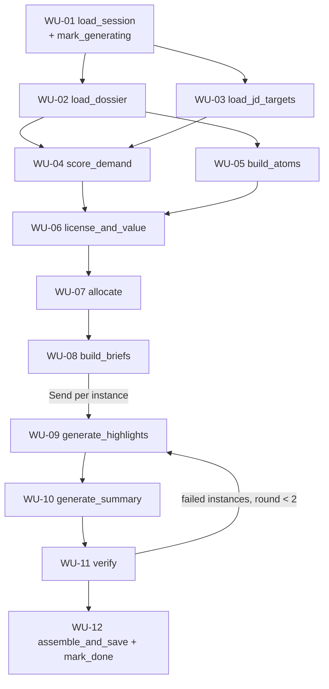

# Resume Generate Graph Plan

Generate a JD-tailored resume as **JSON Resume v1.0.0** plus a provenance
`trace`, from one candidate's Neo4j data graph and one Supabase resume-builder
session. This is step 5 (`generate`) of the resume-builder machine
(`job-description → gap-analysis → gap-interview → template → generate`).

## Contents

1. [Goal and output](#1-goal-and-output)
2. [Scope](#2-scope)
3. [Prerequisites (out of scope)](#3-prerequisites-out-of-scope)
4. [Data sources as they exist today](#4-data-sources-as-they-exist-today)
5. [Design principles](#5-design-principles)
6. [Graph overview and state](#6-graph-overview-and-state)
7. [Work units](#7-work-units)
8. [Output contract](#8-output-contract)
9. [Tuning constants](#9-tuning-constants)
10. [Testing strategy](#10-testing-strategy)
11. [Build order](#11-build-order)
12. [Open questions](#12-open-questions)

---

## 1. Goal and output

**Invoke:** `{"session_id": "<user_resume_builder uuid>"}`.

**Output:** one JSON document persisted on the session:

- `resume` — a pure JSON Resume document (`basics`, `work`, `education`,
  `certificates`, `skills`, `projects`, `languages`, …) with generated text:
  `basics.summary`, `work[].highlights`, `work[].summary`, `projects[].highlights`,
  and `skills[].name` group labels.
- `trace` — pipeline-only provenance: which graph nodes and evidence atoms back
  each generated line, which JD terms each line was allowed to use, coverage,
  and the gap report.

The renderer reads `resume`; verification, the "why is this here" UI, and
debugging read `trace`.

**Standing constraint:** every generated claim must be traceable to a node or
evidence entry of the selected `Person`. The ontology finds words for experience
the candidate has; it never bridges experience they lack.

---

## 2. Scope

### In scope

- A new LangGraph graph `resume_generate` in this repo
  (`src/jd_agent/graphs/resume_generate/`), mirroring the `gap_collect` layout.
- Deterministic selection (atoms, licensing, allocation) reusing the gap
  collector's closure math.
- LLM generation for highlights and summary with grounded, structured output.
- Deterministic verification with a bounded repair loop.
- Persistence of `resume` + `trace` and a finish event.

### Out of scope (see [Prerequisites](#3-prerequisites-out-of-scope))

JD enrichment, person resolution, Supabase migrations, interview write-back,
template selection, ingestion normalization, and taxonomy fixes. Each has a
defined **fallback** so this graph can ship before its prerequisite lands.

---

## 3. Prerequisites (out of scope)

Each prerequisite is owned by another process. The graph must degrade
gracefully when the prerequisite is missing, using the listed fallback.

### P-1 — JD skill enrichment

| | |
| --- | --- |
| **Owner** | `jd_extract` graph ([plan](jd_extract_graph_plan.md)) |
| **Why** | `job_description.skills` is `[{id, name}]` only (the sampled JD has **73** skills). Without importance, every skill weighs `1.0` and allocation cannot tell must-haves from boilerplate. Qualifiers ("7–10+ years …") live in the requirements section under `sections.canonical`. |
| **Contract** | Per skill, additional keys: `importance: "must" \| "nice"`, `evidence_sentence: str` (verbatim JD span), `min_years: int \| null`, `substitutable: bool` ("or similar", "familiarity with"), `surface_form: str` (the JD's exact spelling, for ATS literal match). |
| **Fallback** | `importance = "must"`, `evidence_sentence = ""`, `min_years = null`, `substitutable = false`, `surface_form = name`. With no `min_years`, the summary claims only total years, never per-skill years. |

### P-2 — Ingestion normalization

| | |
| --- | --- |
| **Owner** | Resume ingestion pipeline (writes the data graph) |
| **Why** | Dates are free text (`"Mar 2023"`, `"January 2018"`, `"Present"`). `evidence` is a JSON **string** on the edge; `confidence` is mixed (`1.0` vs `"high"`). |
| **Contract** | ISO `YYYY-MM` dates (null end = present); numeric `confidence`. `evidence` may stay a JSON string (Neo4j cannot store lists of maps). |
| **Fallback** | WU-02 normalizes on read (date parser + `json.loads` + confidence map `high→0.9, medium→0.6, low→0.3`). |

### P-3 — Supabase persistence columns

| | |
| --- | --- |
| **Owner** | Fullstack migrations (`apps/candidate/supabase/migrations`) + `libs/supabase-db/src/types.ts` |
| **Why** | `user_resume_builder` has only `gaps` / `gaps_date`. |
| **Contract** | `resume jsonb`, `resume_trace jsonb`, `resume_date timestamptz`; status values `generate_in_progress` / `generate` (already implied by the `{step}_in_progress` convention). Update policy allowing the agent's secret-key writes. |
| **Fallback** | None for production. For development, write to state only and skip `save_resume`. |

### P-4 — Gap interview write-back

| | |
| --- | --- |
| **Owner** | `mylinkedge.agent.interview` (`jd_gaps_interview`) |
| **Why** | The interview's value (latent → confirmed) only reaches the resume if answers become graph evidence. |
| **Contract** | Confirmed answers are appended as evidence entries `{evidenceText, sourceKind: "interview", confidence, sourceDocumentId}` on the correct **instance** edge (`ExperienceEvent -USES_SKILL->`, `Achievement -VALIDATES_SKILL->`, or a new `Achievement`), and `user_resume_builder.interviewed = true`. |
| **Fallback** | Generate from resume-sourced evidence only; `trace.meta.interviewed = false`. |

### P-5 — Template step

| | |
| --- | --- |
| **Owner** | Fullstack `template` step |
| **Why** | Page budget and section order depend on the chosen template. |
| **Contract** | `template: {page_budget: 1 \| 2, section_order: [...], max_highlights_total, include_projects: bool}` on the session. |
| **Fallback** | Defaults in [Tuning constants](#9-tuning-constants) (2-page budget). |

### P-6 — Embedding model identity

| | |
| --- | --- |
| **Owner** | Ingestion (whoever writes `Position.embedding`, `Skill.embedding`) |
| **Why** | WU-07 compares the JD title to held `Position` nodes via the `vector_position_embedding` index; the JD title must be embedded with the **same model and dimensions**. |
| **Contract** | Model name + dimensions documented in env/settings. |
| **Fallback** | Role relevance from skill overlap only (Position→Skill edges ∩ demand closure). |

### P-7 — Taxonomy drift (non-blocking)

- `INCLUDES_RESPONSIBILITY` is allowed only from `EducationEvent`, though its
  description says experience event. No `Responsibility` nodes exist today.
- Data has `Position -ENABLES/REQUIRES-> Skill` edges not present in the
  taxonomy snapshot. WU-07 uses them; the taxonomy should declare them.

---

## 4. Data sources as they exist today

Snapshot from read-only queries against the local `data` database and Supabase
(Sep 2026). Re-verify with the `taxonomy-neo4j-context` skill before relying on
edge contracts.

### Neo4j data graph (per `Person`)

| Node / edge | Key properties | Resume use |
| --- | --- | --- |
| `Person` | `firstName`, `lastName`, `email`, `phone_number`, `linkedin`, `address` | `basics` |
| `Person -LOCATED_IN-> Location` | `city`, `state`, `country` | `basics.location` |
| `Person -HAD_EXPERIENCE-> ExperienceEvent` | `summary` (1–3 sentence narrative), `startDate`, `endDate`, `employmentType`, `teamSize`, `_data.heading` | `work[]` header + summary-sentence atoms |
| `ExperienceEvent -HAS_POSITION-> Position` (Global) | `name`, `_alias`, `desc`, `embedding` | `work[].position`, `basics.label` |
| `ExperienceEvent -AT_COMPANY-> Company` (Global) `-IN_INDUSTRY-> Industry` | `name`, `description`, `embedding` | `work[].name`, `work[].summary` context, Domain signal |
| `ExperienceEvent -USES_SKILL-> Skill` | `evidence` (JSON string, usually 1 entry, short span), `verificationStatus` (all `self_claimed`) | Skill set of summary-sentence atoms |
| `ExperienceEvent\|Project -PRODUCED-> Achievement` | `name`, `desc` (full sentence), `impactValue` (`"99.7%"`) | **Best bullet atoms** |
| `Achievement -VALIDATES_SKILL-> Skill` | `evidence` | Achievement atom skills |
| `ExperienceEvent -WORKED_ON-> Project` | `name`, `summary`; `-USES_SKILL->` | Project atoms (folded into the role) |
| `ExperienceEvent -INCLUDED_MENTORSHIP-> Mentorship` | `summary`, `count`, `duration`; `-TEACHES_SKILL->` | Mentorship atoms |
| `Person -HAD_EDUCATION-> EducationEvent` | `summary`, `startDate`, `endDate`, `gpa` | `education[]` |
| `EducationEvent -FROM_INSTITUTION / RESULTED_IN_DEGREE / LEARNED_SKILL->` | institution `name`, degree `name`; `-HAS_SPECIALIZATION-> Specialization {level, name}` | `education[]` fields |
| `ProfessionalCertificate -CERTIFIES_SKILL-> Skill` | `name`, `issuer`, `verificationStatus: verified` | `certificates[]`, strong evidence |
| `Person -HAS_SKILL-> Skill` | `evidence` (often from the profile paragraph) | Skills-section eligibility only |
| `Skill -USES/REQUIRES/ENABLES/PART_OF-> Skill` (Global) | ~36k `PART_OF`, ~120 each of the others | Closures (demand, supply, licensing) |

Only **Global** nodes carry embeddings (`Skill`, `Position`, `Company`, …).
Instances and evidence spans do not.

### Supabase

| Table.column | Shape | Use |
| --- | --- | --- |
| `user_resume_builder` | `id`, `user_id` (= Neo4j `ownerId`), `status`, `job_description_id`, `interviewed`, `gaps`, `gaps_date` | Session, status machine, prior gaps |
| `job_description.skills` | `[{id, name}]` (+ P-2 fields when available) | Demand seeds |
| `job_description.sections` | `title`, `canonical.sections[]` (`section_type`, `heading`, `content`) | JD title for role relevance and summary; qualifier text. Flat legacy fields are a read-time projection, not stored |
| `job_description.title_name`, `company_name` | strings | Summary targeting |

---

## 5. Design principles

1. **One candidate.** Every traversal is scoped by `ownerId` (= `session.user_id`),
   never by `Person.id`. An owner with more than one `Person` node is rejected
   in WU-01.
2. **Atoms, not skills, are the unit of selection.** A bullet is one
   accomplishment covering several skills. Skills are the unit of *scoring*.
3. **One definition of "implied".** Licensing and value both use the calibrated
   closures from the gap collector. No new path-confidence constants.
4. **Resume fit, not profile fit.** Allocation maximizes how well the *selected
   resume content* covers JD demand, starting from an empty resume.
5. **Deterministic first.** Only highlights, work summaries, skill group labels,
   and `basics.summary` use an LLM. Everything else is data mapping.
6. **The LLM rewrites; it does not add.** Structured output declares the atoms
   and terms used; the verifier enforces it.
7. **Use the JD's spelling.** A licensed skill is written with the JD's
   `surface_form` so literal ATS matchers hit it.

---

## 6. Graph overview and state

### Flow



WU-02 and WU-03 are independent and may run in parallel (fan-out from WU-01,
join at WU-04).

### Package layout

```
src/jd_agent/graphs/resume_generate/
  resume_generate_graph.py
  state.py
  models.py                 # Dossier, Atom, Brief, GeneratedHighlight, Trace
  events.py                 # ResumeGenerateFinish
  nodes/                    # one package per node
    load_session/           # WU-01
    mark_generating/        # WU-01
    load_dossier/           # WU-02
    load_jd_targets/        # WU-03
    score_demand/           # WU-04
    build_atoms/            # WU-05
    license_and_value/      # WU-06
    allocate/               # WU-07
    build_briefs/           # WU-08
    generate_highlights/    # WU-09 (agent.py + prompts.py + node.py)
    generate_summary/       # WU-10
    verify/                 # WU-11
    assemble_and_save/      # WU-12
    mark_done/              # WU-12
src/jd_agent/integrations/skills_graph/owner_nodes.py         # WU-01 Person count by ownerId
src/jd_agent/integrations/skills_graph/candidate_dossier.py   # WU-02 Cypher
```

### State

```python
class ResumeGenerateState(TypedDict, total=False):
    # Input
    session_id: str

    # WU-01
    session: UserResumeBuilder
    jd: JobDescription
    user_id: str                 # Neo4j ownerId; scopes every graph read
    template: dict[str, Any]     # P-5 or defaults

    # WU-02 / WU-03
    dossier: dict[str, Any]      # Dossier.model_dump()
    jd_targets: list[dict[str, Any]]   # resolved, weighted JD skills

    # WU-04
    demand: dict[str, Any]       # d_star, s_star, zones, weights, fit_profile

    # WU-05 / WU-06 / WU-07
    atoms: list[dict[str, Any]]
    allocation: dict[str, Any]   # instance order, budgets, selected atom ids

    # WU-08 / WU-09 / WU-10
    briefs: dict[str, Any]       # per-instance generation briefs + static sections
    generated: Annotated[dict[str, Any], merge_dicts]   # instance_id -> highlights
    summary: dict[str, Any]

    # WU-11
    verification: dict[str, Any]
    repair_round: int

    # WU-12
    resume: dict[str, Any]
    trace: dict[str, Any]
    generate_status: Literal["generating", "done", "failed"]
    errors: list[str]
```

`generated` uses a dict-merge reducer so parallel `Send` branches can each write
their instance's result.

---

## 7. Work units

Each unit is independently implementable and testable against fixture state.
"Depends on" lists **data** dependencies, not implementation order.

---

### WU-00 — Scaffolding and contracts

**Job.** Create the package, state, Pydantic models, graph wiring with stub
nodes, and the output schema, so every other unit can be developed in parallel
against stable contracts.

**Techniques.**

- Mirror [`gap_collect_graph.py`](../src/jd_agent/graphs/gap_collect/gap_collect_graph.py)
  and [`gap_collect/state.py`](../src/jd_agent/graphs/gap_collect/state.py).
- Reuse the JSON Resume models from the sibling repo rather than redefining them:
  [`resume_schemas.py`](../../mylinkedge.agent.resume/src/resume_agent/shared/resume_schemas.py)
  (`JsonResumeBasics`, `JsonResumeWork`, `JsonResumeEducation`,
  `JsonResumeSkill`, `TailoredJsonResume.to_json_resume`). Either vendor them
  into `jd_agent/shared/` or move them to `mylinkedge.agent.tools` as a shared
  package (preferred; see open question Q-4).
- Register the graph in `langgraph.json`.

**Outputs.** `ResumeGenerateState`, `models.py` (`Dossier`, `Instance`,
`Atom`, `LicensedTerm`, `InstanceBrief`, `GeneratedHighlight`, `ResumeTrace`),
graph compiling with stubs.

**Acceptance.** The graph compiles; a smoke test invokes it with stubbed nodes
and produces an empty but schema-valid `resume`.

---

### WU-01 — `load_session`, `mark_generating`

**Job.** Hydrate the session + JD, take the owner id, load template settings,
and mark the step in progress.

**Inputs.** `session_id`.
**Outputs.** `session`, `jd`, `user_id`, `template`, `generate_status`.

**Techniques.**

- Postgres access goes through the shared `mylinkedge-agent-tools-postgres`
  lib (`get_postgres_db().user_resume_builders`):
  `get_with_job_description(id)`, `update_status(id, status)`, and
  `save_resume(id, resume, resume_trace)` (used by WU-12).
- Fail if `extraction_status != "done"` (same rule as `gap_collect`).
- `user_id = session.user_id` is the Neo4j `ownerId`, as in `gap_collect` and
  [`user_skills.py`](../src/jd_agent/integrations/skills_graph/user_skills.py).
  No `Person.id` is resolved or stored.
- [`count_owner_nodes`](../src/jd_agent/integrations/skills_graph/owner_nodes.py)
  counts `Person {ownerId}`; more than one → raise. Zero is not checked here.
- `mark_generating` sets `generate_in_progress` on this session only (never
  `advance_status_by_job_description_id`, which touches every session of a
  shared JD).
- Soft precondition: if `interviewed = false`, continue; WU-12 reads
  `session.interviewed` for `trace.meta.interviewed` (P-4 fallback).

**Edge cases.** Several Persons under one owner → raise. Missing template →
defaults.

**Acceptance.** Unit tests for missing session, unextracted JD, empty
`user_id`, 0 / 1 / many Persons; status set to `generate_in_progress` on the
one session.

---

### WU-02 — `load_dossier`

**Job.** Load everything about one `Person` needed for the resume in one
round-trip, and normalize it into a typed `Dossier`.

**Inputs.** `user_id` (Neo4j `ownerId`).
**Outputs.** `dossier`.

**Techniques.**

- One Cypher query rooted at `Person {ownerId: $user_id}` (WU-01 guarantees at
  most one) with `OPTIONAL MATCH`
  + `collect` per branch (never cartesian products across branches — collect
  each branch in its own `CALL { … }` subquery):
  - `HAD_EXPERIENCE → ExperienceEvent` with `HAS_POSITION → Position`,
    `AT_COMPANY → Company (-IN_INDUSTRY → Industry)`, `LOCATED_IN → Location`,
    `USES_SKILL → Skill` (edge `evidence`), `PRODUCED → Achievement
    (-VALIDATES_SKILL → Skill)`, `WORKED_ON → Project (-USES_SKILL → Skill,
    -PRODUCED → Achievement)`, `INCLUDED_MENTORSHIP → Mentorship (-TEACHES_SKILL
    → Skill)`.
  - `HAD_EDUCATION → EducationEvent` with institution, degree, specialization,
    `LEARNED_SKILL`, `INCLUDES_COURSE`.
  - Certificates via `RESULTED_IN_PROFESSIONAL_CERTIFICATE` (see Q-3).
  - `HAS_SKILL`, `HAS_LANGUAGE_PROFICIENCY → IN_LANGUAGE`, `LOCATED_IN`,
    `RECEIVED_AWARD`, `AUTHORED`, `HAD_VOLUNTEER_EXPERIENCE`.
- Reuse the driver/settings pattern from
  [`user_skills.py`](../src/jd_agent/integrations/skills_graph/user_skills.py)
  (`Neo4jSettings.from_env().resolved_data_database`, read-only session).
- Normalization (P-3 fallback):
  - Dates: parse `"Mar 2023"`, `"March 2023"`, `"2023"`, `"03/2023"`,
    `"Present"` → `YYYY-MM` / `None`; keep the raw string in `raw_start/raw_end`.
  - `evidence`: `json.loads` string → list of entries; map textual confidence to
    numbers.
  - Skill references carry `{id, name, skillType}` so later units never re-query.
- Always read the skill metadata for the Person's skills from the in-memory
  skills graph ([`get_skills_graph`](../src/jd_agent/integrations/skills_graph/__init__.py)),
  not from the Cypher result, so ids match closure node ids.

**Edge cases.** Missing dates (sort such instances last and never compute years
from them); instances with no Position or Company (use `_data.heading` as a
display fallback); no `Person` for the owner (empty dossier).

**Acceptance.** Fixture test against a recorded Cypher result for the
`doc-full-live:person` subgraph; every instance has normalized dates or explicit
`None`.

---

### WU-03 — `load_jd_targets`

**Job.** Turn the JD row into weighted demand seeds resolved to Skill graph ids,
plus the JD context the summary needs.

**Inputs.** `jd`.
**Outputs.** `jd_targets` (`[{skill_id, name, surface_form, skill_type,
importance, weight, min_years, substitutable, evidence_sentence}]`),
`jd_context` (`title`, `company_name`, `requirements` text).

**Techniques.**

- Start from [`load_jd_targets`](../src/jd_agent/graphs/gap_collect/nodes/load_jd_targets/node.py)
  and [`_resolve_jd_skills`](../src/jd_agent/graphs/gap_collect/nodes/compute_gaps/node.py)
  (id first, then case-folded name). Extract `_resolve_jd_skills` into a shared
  helper so both graphs use the same resolution.
- Weight mapping: `must → 1.0`, `nice → 0.5`, missing → `1.0` (P-2 fallback).
- Keep unresolved names in `trace.meta.unresolved` (same semantics as
  `gaps.meta.unresolved`).
- Separate Domain skills (`skillType == "Domain"`) into `jd_domains`; they are
  masked from closures but drive the summary and industry framing.

**Acceptance.** Works with both enriched and bare `{id, name}` skills.

---

### WU-04 — `score_demand`

**Job.** Compute, for this Person, the JD demand closure, the profile supply
closure, per-skill zones, and profile fit. This is the baseline every later unit
consults.

**Inputs.** `jd_targets`, `dossier` (all instance skill ids).
**Outputs.** `demand = {d_star, weights, s_star_profile, zones, latent_kind,
fit_profile, edges_subset}`.

**Techniques (reuse, do not re-implement).**

- [`demand_closure`](../src/jd_agent/graphs/gap_collect/nodes/compute_gaps/closures.py)
  seeded with `{skill_id: weight}`.
- [`supply_closure_noisy_or`](../src/jd_agent/graphs/gap_collect/nodes/compute_gaps/closures.py)
  seeded with the Person's **instance** evidence skills (USES_SKILL,
  VALIDATES_SKILL, LEARNED_SKILL, TEACHES_SKILL, CERTIFIES_SKILL) at `1.0`.
  `HAS_SKILL`-only skills seed at a lower value (e.g. `0.5`), since they carry no
  context.
- [`compute_gaps`](../src/jd_agent/graphs/gap_collect/nodes/compute_gaps/zones.py)
  for `fit_profile`; [`personalized_pagerank`](../src/jd_agent/graphs/gap_collect/nodes/compute_gaps/zones.py)
  + [`assign_zone`](../src/jd_agent/graphs/gap_collect/nodes/compute_gaps/zones.py)
  for zones; [`make_is_domain`](../src/jd_agent/graphs/gap_collect/nodes/compute_gaps/closures.py)
  and [`scc_warn`](../src/jd_agent/graphs/gap_collect/nodes/compute_gaps/closures.py).
- **Recompute; don't read persisted `gaps`.** Persisted gaps are pre-interview. Read `session.gaps.meta.fit` only to report
  `trace.fit.before_interview`.
- **Edge pruning for speed** (WU-06 calls the supply closure many times):
  build `edges_subset` = edges whose source is within `SUPPLY_HOPS` influence
  hops *upstream* of any `d_star` node. Supply only matters where it lands on
  demand, and the skill graph is ~36k edges (99% `PART_OF`).

**Acceptance.** For a fixture Person, zones match a hand-checked expectation;
`edges_subset` gives identical `s_star` on `d_star` nodes to the full edge list.

---

### WU-05 — `build_atoms`

**Job.** Break each instance into **evidence atoms**: the smallest units a
resume line can be built from, each with real source text, a skill set, and
metrics.

**Inputs.** `dossier`.
**Outputs.** `atoms: [Atom]`.

```python
class Atom(BaseModel):
    atom_id: str                 # e.g. "ach:<achievement id>", "sum:<exp id>#2"
    instance_id: str             # ExperienceEvent / Project / EducationEvent id
    parent_instance_id: str | None   # Project → its ExperienceEvent
    kind: Literal["achievement", "project", "mentorship", "summary_sentence"]
    text: str                    # verbatim source text
    skill_ids: list[str]
    metrics: list[str]           # impactValue + numbers found in text
    node_ids: list[str]          # provenance for trace
    evidence_texts: list[str]
    end: str | None              # instance end (YYYY-MM or None = present)
    source_kinds: set[str]       # resume / interview / …
    strength: float
```

**Techniques.**

- **Achievement atoms:** `text = desc` (fallback `name`), `metrics =
  [impactValue] + numbers(desc)`, skills from `VALIDATES_SKILL`.
- **Project atoms:** `text = summary`, skills from `USES_SKILL`. Project
  achievements become their own achievement atoms with `parent_instance_id` set.
- **Mentorship atoms:** `text = summary` (+ `count` as a metric), skills from
  `TEACHES_SKILL`.
- **Summary-sentence atoms:** split `ExperienceEvent.summary` into sentences
  (regex splitter that respects abbreviations, e.g. `pysbd` or a simple rule
  set). Attach each `USES_SKILL` edge to the sentence its `evidenceText` came
  from:
  1. normalized substring match; else
  2. highest token-overlap (Jaccard ≥ 0.4); else
  3. an instance-level "context" bucket (skills only, no text; used for
     licensing context, never as a bullet by itself).
- **Deduplication:** drop a summary sentence when an achievement atom of the same
  instance overlaps it (token Jaccard ≥ 0.5 or shares a metric). The achievement
  is always the better bullet.
- **Metric extraction:** regex for percentages, multipliers, currency, counts
  with units, time durations (`\d+(\.\d+)?\s?(%|x|ms|s|hours?|days?|k|m|M|\+)`,
  `\$\d…`). These become the verifier's allow-list (WU-11).
- **Strength** (uncalibrated placeholder, same status as
  [`ranking.py`](../src/jd_agent/graphs/gap_collect/nodes/rank_queue/ranking.py)
  coefficients):

  \[
  \text{strength} = \text{base}_{kind} \cdot \max\big(0.5,\ e^{-\text{age\_months}/60}\big) \cdot (1 + 0.1\cdot[\text{interview source}])
  \]

  with `base`: achievement with metric `1.0`, achievement `0.85`, project `0.75`,
  mentorship `0.7`, summary sentence with a number `0.7`, otherwise `0.6`.
  `verificationStatus` is not used while every edge is `self_claimed`.

**Acceptance.** For the Jifiti 2023 experience, every `USES_SKILL` edge lands in
exactly one atom or the context bucket; no duplicate achievement/sentence pairs.

---

### WU-06 — `license_and_value`

**Job.** For each atom, decide **which JD terms it may use** and **how much it
is worth** for this JD.

**Inputs.** `atoms`, `demand`, `jd_targets`.
**Outputs.** Atoms enriched with `licensed: [{jd_skill_id, surface_form, via:
"explicit" | "implied", s}]`, `adjacent: [...]` (never licensed), and
`standalone_value` (Δfit from an empty resume).

**Techniques.**

- **Licensing.** Run `supply_closure_noisy_or` seeded with *only the atom's
  skills* (plus the instance's context-bucket skills at `0.5`) over
  `edges_subset`. A JD skill `j` in `d_star` is licensed if:
  - `j ∈ atom.skill_ids` → `via = "explicit"`; or
  - `s*_atom(j) ≥ LICENSE_TAU` (`0.8`) → `via = "implied"`.

  With the calibrated `ALPHA` table in
  [`closures.py`](../src/jd_agent/graphs/gap_collect/nodes/compute_gaps/closures.py),
  `0.8` admits exactly one forward `REQUIRES` (0.90), `USES` (0.85), or
  `ENABLES` (0.80) hop, and rejects `PART_OF` (0.35 / 0.55) and any two-hop
  chain (e.g. `USES·USES = 0.72`). "Spring Boot → Java" is licensed; "Prometheus
  → Observability" is not.
- **Adjacent.** JD skills with `0 < s*_atom(j) < LICENSE_TAU`, or zone
  `latent/adjacent` at profile level: recorded for the gap report, never
  licensed. If the JD marks the skill `substitutable` (P-2), the *atom's own
  skill name* may be written ("RabbitMQ"), never the JD term ("Kafka").
- **Domain skills.** Licensed only if explicit on the atom or its instance
  (e.g. `USES_SKILL → Fintech`, `Company -IN_INDUSTRY-> Fintech`).
- **Standalone value.** `Δfit(a | ∅) × strength`, using `compute_gaps` with the
  WU-04 `d_star` and `weights`.

**Acceptance.** Property tests: explicit ⊆ licensed; no licensed skill outside
`d_star`; PART_OF-only paths never license.

---

### WU-07 — `allocate`

**Job.** Choose which atoms become lines, how many lines each instance gets,
and in what order instances appear, maximizing JD coverage of the *resume* under
the template's budget.

**Inputs.** `atoms` (with value), `demand`, `dossier`, `template`, `jd_context`.
**Outputs.** `allocation = {instance_order, tiers, budgets, selected:
{instance_id: [atom_id]}, resume_fit, covered_jd_skill_ids}`.

**Techniques.**

- **Objective.** Greedy maximization of resume fit:

  \[
  \Delta\text{fit}(a \mid C) = \text{fit}\big(s^*(C \cup a)\big) - \text{fit}\big(s^*(C)\big),\qquad
  \text{gain}(a) = \Delta\text{fit}(a \mid C)\cdot \text{strength}(a)
  \]

  where `C` is the set of skills already covered by selected atoms, `s*` is
  `supply_closure_noisy_or` over `edges_subset`, and `fit` comes from
  `compute_gaps`. Noisy-OR saturation gives diminishing returns automatically:
  once Java is proven, a second Java-only atom gains almost nothing.
- **Lazy greedy (CELF).** Keep a max-heap of stale gains; re-evaluate only the
  top candidate until it stays on top. This typically cuts closure calls by an
  order of magnitude versus naive greedy.
- **Instance relevance and tiers.**
  - `relevance(i) = Σ standalone_value of its top-3 atoms
    + λ·cos(Position.embedding, embed(jd_title))` (P-7; fallback: Jaccard of
    `Position -ENABLES/REQUIRES-> Skill` targets with `d_star`).
  - Tiers by rank and recency: **A** (top 2 relevant within 10 years) up to 5
    lines; **B** up to 3; **C** 1; **D** header only (older than 15 years or
    irrelevant).
- **Constraints.**
  - Global cap `MAX_HIGHLIGHTS_TOTAL` (template or default).
  - Every shown instance gets ≥ 1 line if it has any atom, so the timeline has no
    empty roles. This is a *coverage* decision, not a ranking one.
  - **Promotion groups:** consecutive ExperienceEvents at the same `Company`
    (e.g. Jifiti 2021 → 2023, Bank Hapoalim 2017 → 2020) share one budget and one
    coverage set, so the same skill is not proven twice in the same company.
  - Stop when `gain < MIN_GAIN` after the per-instance minimums are met.
- **Ordering.** `work[]` stays reverse-chronological (ATS convention); tiers
  change line counts, not order. Within an instance, lines are ordered by gain.

**Acceptance.** Deterministic for a fixed input; a test where two atoms prove
only the same skill shows the second is skipped; minimum-one-line rule holds.

---

### WU-08 — `build_briefs`

**Job.** Produce (a) per-instance **generation briefs** for WU-09, and (b) the
**deterministic sections** that need no LLM.

**Inputs.** `dossier`, `allocation`, `atoms`, `demand`, `jd_targets`.
**Outputs.** `briefs = {instances: {instance_id: InstanceBrief}, static:
{basics, education, certificates, languages, awards, publications, volunteer,
skills}}`.

**Techniques.**

- **`InstanceBrief`**: header (`company`, `position`, `startDate`, `endDate`,
  `location`, `employmentType`, `teamSize`, `industry`, `company_description`),
  `budget`, `tense` (`present` if `endDate is None` else `past`), and the
  selected atoms with `text`, `metrics`, and `licensed` (`surface_form` list).
- **`basics`** (deterministic): `name = firstName + lastName`, `email`, `phone`
  (`phone_number`), `profiles = [{network: "LinkedIn", url: linkedin}]`,
  `location` from `Person -LOCATED_IN-> Location`.
  `label` = the held `Position.name` (or one of its `_alias`) most similar to the
  JD title, ties broken by recency. Never the JD title unless it is one of the
  candidate's aliases.
- **`education[]`**: `institution` (FROM_INSTITUTION), `studyType`
  (Specialization.level or AcademicDegree name), `area` (Specialization.name),
  dates, `score` (gpa), `courses` (INCLUDES_COURSE). Reverse-chronological.
- **`certificates[]`**, **`languages[]`**, **`awards[]`**, **`publications[]`**,
  **`volunteer[]`**: direct mappings when present.
- **`skills[]`**:
  - Eligible keywords: JD skills licensed by **any** atom of the Person, plus
    explicit `HAS_SKILL` / certificate skills that are in `d_star`. Written with
    the JD `surface_form`.
  - Plus up to `N_EXTRA_SKILLS` strong non-JD skills (highest profile
    `s_star` among explicit skills) for credibility.
  - Group by `PART_OF` parent, reusing the idea in
    [`_theme_label`](../src/jd_agent/graphs/gap_collect/nodes/compute_gaps/zones.py)
    applied to *covered* skills (the gap collector applies it to unmet ones).
    Cap at `MAX_SKILL_GROUPS × MAX_KEYWORDS_PER_GROUP`, ordered by
    `Σ weight × d_star`.
  - Group names: the parent skill name by default; optional small LLM call to
    rename groups into resume-style labels ("Cloud & Infrastructure"). No
    keywords are added by the LLM.
- **Years facts** (for WU-10): total years = interval union over all
  ExperienceEvents; per must-have skill with `min_years`, interval union over
  instances that license it. Reuse the interval-union approach from the
  [pipeline doc](Graph-Based%20ATS%20Resume%20Tailoring%20Pipeline%20%26%20Worked%20Example.md#step-3--qualifier-check)
  (merge overlapping ranges, don't sum).

**Acceptance.** Static sections are schema-valid JSON Resume; no skill keyword
lacks a licensing source in `trace`.

---

### WU-09 — `generate_highlights` (LLM, fan-out)

**Job.** Rewrite each instance's selected atoms into resume bullets (and an
optional one-line `work[].summary`) using only licensed vocabulary.

**Inputs.** One `InstanceBrief` per `Send`, plus `verification.feedback[instance_id]`
on repair rounds.
**Outputs.** `generated[instance_id] = {summary, highlights: [GeneratedHighlight]}`.

```python
class GeneratedHighlight(BaseModel):
    text: str
    atom_ids: list[str]          # ⊆ brief atom ids (1–2 atoms per line)
    jd_terms_used: list[str]     # ⊆ union of licensed surface_forms of atom_ids
```

**Techniques.**

- LangGraph `Send("generate_highlights", {"brief": ..., "feedback": ...})` per
  instance from a conditional edge after WU-08 (and after WU-11 for failed
  instances only).
- Model setup: follow
  [`extract_jd_info/agent.py`](../src/jd_agent/graphs/jd_extract/nodes/extract_jd_info/agent.py)
  (`create_agent` + `response_format`, LiteLLM base URL, temperature ≤ 0.3).
  Prompts in `prompts.py`, optionally sourced from `agent_prompt_config` like
  [`prompt_config_repository.py`](../src/jd_agent/integrations/supabase/prompt_config_repository.py).
- Prompt rules (enforced again by WU-11):
  - Exactly `budget` bullets; each built from 1–2 listed atoms.
  - Use listed JD TERMS verbatim where the atom supports them; no other tools,
    technologies, clients, or scope.
  - Keep every number exactly; add no numbers.
  - Start with a strong verb; past tense for past roles, present tense for the
    current role; no first person; ≤ 30 words.
  - No two bullets in the instance start with the same verb.
  - Action + scope + result ordering when a metric exists.
- The optional `work[].summary` (≤ 20 words) may use only the header fields
  (industry, company description, team size).

**Acceptance.** Structured output validates; `atom_ids` and `jd_terms_used` are
subsets of the brief (checked in-node before returning).

---

### WU-10 — `generate_summary` (LLM)

**Job.** Write `basics.summary` last, once the highlights exist, so the summary
reflects what the resume actually proves.

**Inputs.** `briefs.static.basics.label`, years facts, covered JD themes (skill
group names ordered by weight), top-strength achievement metric, licensed Domain
skills, `jd_context.title`, all generated highlights.
**Outputs.** `summary = {text, claimed_terms, claimed_numbers}`.

**Techniques.**

- 2–4 sentences, ≤ 60 words, no first person.
- Must include total years only from the years facts; per-skill years only when
  P-2 `min_years` exists **and** the interval union meets it (a failed qualifier
  is omitted, not softened).
- May name only JD terms already present in highlights or the skills section.
- One flagship metric, copied verbatim from an atom.

**Acceptance.** `claimed_terms` ⊆ licensed terms; `claimed_numbers` ⊆ atom
metrics ∪ years facts.

---

### WU-11 — `verify`

**Job.** Deterministically check every generated line against its sources;
route failures back to WU-09 with named violations; compute the coverage and
gap reports.

**Inputs.** `generated`, `summary`, `briefs`, `atoms`, `demand`, `repair_round`.
**Outputs.** `verification = {passed, failed_instances, feedback, dropped,
coverage, gap_report}`, `repair_round`.

**Checks per highlight.**

| Check | Rule |
| --- | --- |
| Atom subset | `atom_ids ⊆ brief.atom_ids` |
| Term license | Every `jd_terms_used` ∈ licensed surface forms of its atoms |
| Hidden terms | No other `d_star` skill name/alias appears in the text unless licensed (alias-aware scan) |
| Numbers | `numbers(text) ⊆ ∪ atom.metrics` |
| Style | ≤ 30 words; tense matches `brief.tense`; no first person; no duplicate leading verb within an instance |
| Duplication | No near-duplicate lines across the resume (token Jaccard ≥ 0.7) |

**Routing.**

- A conditional edge re-sends only failed instances to WU-09 with `feedback`
  (the violated rule + offending span) while `repair_round < 2`.
- After two failed rounds, drop the line and promote the next unselected atom of
  that instance (from WU-07's heap order) for one final attempt, or leave the
  instance one line shorter.

**Reports.**

- **Coverage:** weighted share of JD skills whose `surface_form` literally
  appears anywhere in `resume` (alias-aware), split into must/nice.
- **Gap report:** JD skills that are `adjacent` or `true_gap` for the resume,
  with the reason (no evidence; adjacent via X; qualifier `min_years` not met).

**Acceptance.** Seeded violations (invented number, unlicensed term, wrong
tense) are each caught and produce feedback.

---

### WU-12 — `assemble_and_save`, `mark_done`

**Job.** Assemble the final JSON Resume + trace, persist them, advance the
session, and publish the finish event.

**Inputs.** Everything above.
**Outputs.** `resume`, `trace`, persisted row, `generate_status = "done"`.

**Techniques.**

- Build with the JSON Resume models (WU-00); `to_json_resume()` strips
  pipeline-only fields such as `instance_id`.
- Omit empty sections; omit `endDate` for current roles (JSON Resume
  convention).
- Persist via the new repository function `save_resume(client, session_id,
  resume, trace)` (P-4), modeled on
  [`save_gaps`](../src/jd_agent/integrations/supabase/user_resume_builder_repository.py).
- Publish `process.resume-generate/finish` via `ProcessEventPublisher`, modeled
  on [`mark_done`](../src/jd_agent/graphs/gap_collect/nodes/_legacy.py) and
  [`events.py`](../src/jd_agent/graphs/gap_collect/events.py); publish failure
  is a soft error.
- On any unhandled node error: set status back to `template` (or a `failed`
  marker per P-4) and re-raise, matching the jd_extract failure contract.

**Acceptance.** Integration test (like
[`integration_test_gap_collect_graph.py`](../tests/graphs/integration_test_gap_collect_graph.py))
writes a schema-valid resume for a fixture session.

---

## 8. Output contract

Persisted as `user_resume_builder.resume` and `user_resume_builder.resume_trace`
(P-4).

```json
{
  "resume": {
    "$schema": "https://raw.githubusercontent.com/jsonresume/resume-schema/v1.0.0/schema.json",
    "basics": {
      "name": "Dvir Versano",
      "label": "Software & Cloud Architect",
      "email": "…",
      "phone": "…",
      "summary": "Cloud architect with 12+ years building multi-tenant fintech platforms …",
      "location": {"city": "…", "countryCode": "…"},
      "profiles": [{"network": "LinkedIn", "url": "…"}]
    },
    "work": [
      {
        "name": "Jifiti",
        "position": "Software & Cloud Architect",
        "startDate": "2023-03",
        "summary": "Embedded-lending fintech platform serving Tier-1 banks.",
        "highlights": [
          "Architected cross-region AWS network topology for a multi-tenant white-label lending platform …"
        ]
      }
    ],
    "education": [
      {"institution": "…", "studyType": "Bachelor", "area": "Computer Science", "endDate": "…"}
    ],
    "certificates": [{"name": "…", "issuer": "…"}],
    "skills": [
      {"name": "Cloud & Infrastructure", "keywords": ["AWS", "Amazon EKS", "Microservices"]}
    ],
    "projects": [],
    "languages": [],
    "meta": {"version": "v1.0.0", "lastModified": "2026-09-23T00:00:00Z"}
  },
  "trace": {
    "schema_version": 1,
    "meta": {
      "user_id": "39f3d192-462b-4b2b-a8d6-b3b2514a1d2a",
      "job_description_id": "…",
      "interviewed": false,
      "jd_enriched": false,
      "unresolved": ["…"],
      "constants": {"license_tau": 0.8, "min_gain": 0.01}
    },
    "fit": {"before_interview": 0.62, "profile": 0.71, "resume": 0.66},
    "lines": {
      "work[0].highlights[0]": {
        "atom_ids": ["sum:exp-jifiti-2023#2"],
        "node_ids": ["experience:…", "…"],
        "jd_skill_ids": ["…"],
        "licensed_via": {"AWS": "explicit", "Cloud Architecture": "implied:USES"},
        "repair_rounds": 0
      },
      "basics.summary": {"claimed_terms": ["…"], "claimed_numbers": ["12+"]}
    },
    "skills_sources": {"AWS": ["sum:exp-jifiti-2023#2", "has_skill"]},
    "coverage": {"weighted": 0.81, "must": {"covered": 9, "total": 11}, "nice": {"covered": 3, "total": 6}},
    "gap_report": [
      {"skill_id": "…", "name": "Apache Kafka", "status": "adjacent", "via": "RabbitMQ",
       "advice": "The JD accepts similar tools; RabbitMQ is named instead of Kafka."}
    ],
    "dropped_lines": []
  }
}
```

Line keys in `trace.lines` use JSON-pointer-like paths into `resume` so the UI
can annotate any rendered line.

---

## 9. Tuning constants

All are **uncalibrated starting values**; keep them in one `constants.py` and
echo them into `trace.meta.constants`.

| Constant | Start | Used in | Symptom if wrong |
| --- | --- | --- | --- |
| `LICENSE_TAU` | 0.80 | WU-06 | Lower → capability claims outrun evidence; higher → Spring Boot no longer licenses Java |
| `HAS_SKILL_SEED` | 0.50 | WU-04 | Higher → skills-list claims count as proven experience |
| `CONTEXT_SEED` | 0.50 | WU-06 | Higher → atoms license terms from sibling sentences |
| `MIN_GAIN` | 0.01 | WU-07 | Lower → filler lines; higher → thin resume |
| `MAX_HIGHLIGHTS_TOTAL` | 18 (2 pages) / 10 (1 page) | WU-07 | Page overflow or sparse roles |
| Tier budgets A/B/C/D | 5 / 3 / 1 / 0 | WU-07 | Old roles crowd out recent ones |
| `RECENCY_MONTHS` | 60 | WU-05 | Shorter → solid mid-career work disappears |
| `λ` (title similarity) | 0.3 | WU-07 | Higher → title match beats actual evidence |
| `MAX_SKILL_GROUPS` × `MAX_KEYWORDS_PER_GROUP` | 5 × 8 | WU-08 | Keyword stuffing vs missed ATS terms |
| `N_EXTRA_SKILLS` | 6 | WU-08 | Irrelevant skills dilute the JD match |
| `MAX_REPAIR_ROUNDS` | 2 | WU-11 | Latency vs dropped lines |

The `ALPHA`, `DEMAND_GAMMA`, `SUPPLY_HOPS`, `LATENT_DELTA`, and
`PPR_PERCENTILE` values stay owned by the gap collector
([`closures.py`](../src/jd_agent/graphs/gap_collect/nodes/compute_gaps/closures.py),
[`zones.py`](../src/jd_agent/graphs/gap_collect/nodes/compute_gaps/zones.py));
import them, never copy them.

Calibrate against outcomes: recruiter blind ranking of generated vs.
hand-written resumes, then interview-callback data when available.

---

## 10. Testing strategy

| Level | What | Where |
| --- | --- | --- |
| Unit | Date parser, evidence JSON parsing, sentence splitter + evidence attachment, metric regex, licensing properties, CELF greedy vs naive greedy equality, verifier rules | `tests/unit/resume_generate/` |
| Fixture | Recorded dossier for `doc-full-live:person` + a recorded JD; golden `allocation` and `trace.lines` atom ids (LLM mocked) | `tests/fixtures/resume_generate/` |
| Graph | Full graph with a fake LLM that echoes atom text; asserts schema validity and verifier pass | `tests/graphs/test_resume_generate_graph.py` |
| Integration | Live Neo4j + Supabase + LiteLLM on a dev session | `tests/graphs/integration_test_resume_generate_graph.py` |
| Evaluation | LangSmith dataset of (session, reference resume); metrics: coverage, grounding violations, recruiter score | LangSmith experiment |

---

## 11. Build order

1. **WU-00** scaffolding, then **WU-01**, **WU-02**, **WU-03** (data in).
2. **WU-04**, **WU-05**, **WU-06** (deterministic core). The resume's
   `skills[]` and gap report are already producible here.
3. **WU-07**, **WU-08** (selection + static sections). A complete resume minus
   generated text.
4. **WU-09**, **WU-10** (generation), then **WU-11** (verification loop).
5. **WU-12** persistence + event, once P-4 lands.

WU-02 / WU-03, WU-05 / WU-04, and WU-09 / WU-08-static can be built in parallel
by different people once WU-00 contracts exist.

---

## 12. Open questions

- **Q-1** *Resolved.* No `person_id`: everything is scoped by `ownerId`, and
  WU-01 rejects owners with more than one `Person`.
- **Q-2** Should nested Projects ever render as standalone `projects[]`
  entries (e.g. when the parent role is tier D but the project is highly
  relevant)?
- **Q-3** How are `ProfessionalCertificate` nodes linked to a `Person` in data?
  The taxonomy only has `EducationEvent -RESULTED_IN_PROFESSIONAL_CERTIFICATE->`.
- **Q-4** Where should the JSON Resume Pydantic models live: vendored here, or
  promoted from `mylinkedge.agent.resume` into `mylinkedge.agent.tools`?
- **Q-5** *Resolved.* Both graphs scope by `ownerId`, so persisted `gaps` and
  the resume read the same candidate.
- **Q-6** Multi-language resumes: generate in the JD's language or the
  candidate's? (affects WU-09/WU-10 prompts only).
